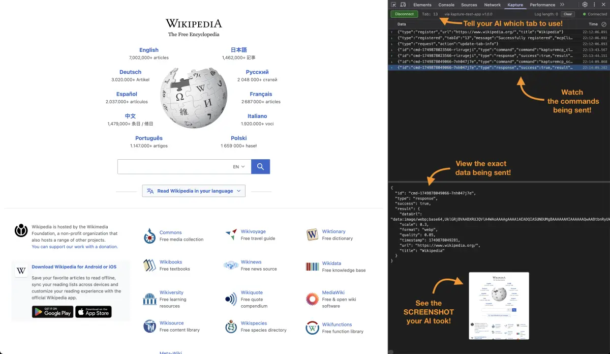

# Kapture - Browser Automation via Chrome DevTools

Kapture is a Chrome DevTools Extension that enables browser automation through the Model Context Protocol (MCP). It allows AI applications like Claude to control web browsers via a three-layer architecture.

**✨ Key Feature**: Run multiple AI assistants simultaneously! Each AI client (Claude Desktop, Cline, etc.) can control different browser tabs using separate ports.



## Overview

Kapture bridges AI assistants with web browsers through:
- **MCP Server**: Handles MCP protocol communication
- **Chrome Extension**: DevTools panel for browser automation
- **WebSocket Bridge**: Real-time communication between server and extensions
- **Multi-Instance Support**: Run multiple AI clients simultaneously on different ports

## Architecture


## Quick Start

### 1. Install Dependencies

```bash
# Server
cd server
npm install
npm run build

# Test App (optional)
cd test-app
npm install
```

### 2. Load Chrome Extension

1. Open Chrome and navigate to `chrome://extensions/`
2. Enable "Developer mode"
3. Click "Load unpacked"
4. Select the `extension` folder

### 3. Start MCP Server
[Configure your AI client](docs/MCP_USAGE.html) and open it. It will start the MCP server automatically.

**OR**

Run the Test App:

```bash
cd test-app
npm run dev
```

The server starts on port 61822 by default. You can specify a custom port:

```bash
# Server
cd server
npm start -- --port 61823

# Test App
cd test-app
npm start -- --port 61823
```

### 4. Connect via DevTools

1. Open any website in Chrome
2. Open Chrome/Brave Developer Tools
3. Navigate to "Kapture" panel
4. The extension will automatically discover available servers (ports 61822-61832)
5. Select a server from the dropdown to connect automatically

## Using with Claude Desktop

Add to your Claude Desktop config:

### Option 1: Using npx (Recommended - No installation required)
```json
{
  "mcpServers": {
    "kapture": {
      "command": "npx",
      "args": ["kapture-mcp-server"]
    }
  }
}
```

### Option 2: Local installation
```json
{
  "mcpServers": {
    "kapture": {
      "command": "node",
      "args": ["/path/to/kapture/server/dist/index.js"]
    }
  }
}
```

## 🚀 Run Multiple AI Assistants Simultaneously

One of Kapture's powerful features is the ability to run multiple AI clients at the same time. Each AI assistant can control different browser tabs without interference by using separate ports. [See the complete guide →](docs/MULTI_ASSISTANT_GUIDE.md)

**Claude Desktop** (using default port 61822):
```json
{
  "mcpServers": {
    "kapture": {
      "command": "npx",
      "args": ["kapture-mcp-server"]
    }
  }
}
```

**Cline/VS Code** (using port 61823):
```json
{
  "cline.mcpServers": {
    "kapture": {
      "command": "npx",
      "args": ["kapture-mcp-server", "--port", "61823"]
    }
  }
}
```

This allows multiple AI clients to control different browser tabs simultaneously without conflict.

### Benefits of Multiple AI Assistants:
- **Parallel Workflows**: Have Claude Desktop research while Cline develops code
- **Specialized Tasks**: Use different AI clients for different types of automation
- **Team Collaboration**: Multiple team members can use their preferred AI tools simultaneously
- **Testing & Development**: Test automation scripts with one AI while developing with another

Then ask Claude to interact with web pages:
- "Navigate to example.com and take a screenshot"
- "Click the search button"
- "Fill in the email field with test@example.com"

## Available MCP Tools

- `navigate` - Navigate to URL
- `back` - Browser back button
- `forward` - Browser forward button
- `click` - Click elements (uses first matching element, returns unique selector)
- `hover` - Hover over elements (uses first matching element, returns unique selector)
- `fill` - Fill input fields (uses first matching element, returns unique selector)
- `select` - Select dropdown options (HTML `<select>` only, uses first matching element, returns unique selector)
- `evaluate` - Execute JavaScript
- `querySelectorAll` - Query all elements matching a CSS selector

**Note on Selectors**: Tools that accept a `selector` parameter (`click`, `hover`, `fill`, `select`, `screenshot`, `dom`) will only operate on the **first element** that matches the CSS selector. The tool response includes the unique selector of the actual element that was used, which may include an auto-generated ID if the element didn't have one.

### MCP Resources

- `kapture://tabs` - List all connected browser tabs
- `kapture://tab/{tabId}` - Get detailed information about a specific tab
- `kapture://tab/{tabId}/console` - Get console logs from a specific tab (with pagination support)
- `kapture://tab/{tabId}/screenshot` - Capture screenshots of a tab or element
- `kapture://tab/{tabId}/dom` - Get HTML content of a tab or element
- `kapture://tab/{tabId}/elementsFromPoint` - Get elements at specific coordinates
- `kapture://tab/{tabId}/querySelectorAll?selector={selector}` - Query all elements matching a CSS selector

## Development

### Server Development

```bash
cd server
npm run dev    # Development with hot-reload
npm run debug  # With debug logging (KAPTURE_DEBUG=1)
```

### Test App

```bash
cd test-app
npm run dev    # Run Electron test app
```

### Extension Development

After making changes:
1. Go to `chrome://extensions/`
2. Click refresh on Kapture extension


### Key Components

**Server** (`/server`):
- `mcp-handler.ts` - MCP protocol implementation
- `websocket-manager.ts` - WebSocket server
- `tab-registry.ts` - Tab tracking
- `tools/*.ts` - MCP tool implementations

**Extension** (`/extension`):
- `panel/command-executor.js` - Command execution
- `panel/command-queue.js` - Sequential execution
- `background.js` - Screenshot service worker

## DevTools Panel Features

- **Server Discovery** - Automatically finds available servers on ports 61822-61832
- **Server Selection** - Dropdown to choose between multiple running servers
- **Connection Status** - Real-time server connection indicator
- **Tab Info** - Current tab ID and URL display
- **Command Testing** - Manual command execution interface
- **Console Viewer** - Live console log capture
- **History** - Command history
- **Dark Theme** - Toggle between light/dark modes

## Troubleshooting

### Connection Issues
- The extension will automatically scan for servers on ports 61822-61832
- If no servers are found, verify the server is running
- Check the server dropdown to see which servers were discovered
- Check browser console for errors
- Enable MCP Server debug logging: `KAPTURE_DEBUG=1 npm start`

### Extension Not Showing
- Ensure extension is loaded and enabled
- Close and reopen DevTools
- Reload extension in `chrome://extensions/`

### Command Timeouts
- Default timeout is 5 seconds
- Some commands accept custom timeout parameter
- Check element selectors are correct

### Performance Considerations
**Important**: The `click` and `hover` tools may experience performance issues when the Kapture DevTools panel is not the active/selected tab in Chrome DevTools. For optimal performance:
- Keep the Kapture panel selected during automation
- If experiencing delays with click/hover operations, switch to the Kapture panel
- This is due to Chrome's optimization of inactive DevTools panels

## Security

- Commands execute within Chrome's DevTools sandbox
- Each tab has unique ID preventing cross-tab interference
- No direct file system access from extension
- Tab registry enforces command isolation

## License

MIT
