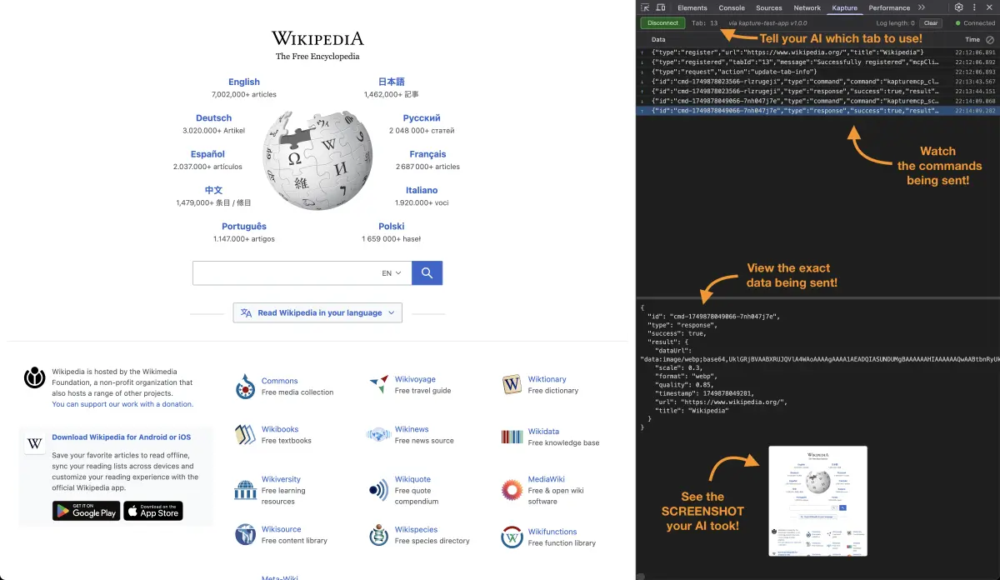
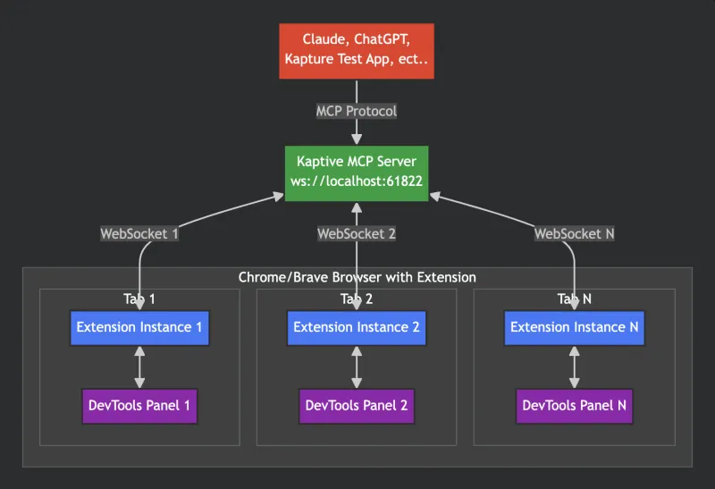

# Kapture - Browser Automation via Chrome DevTools

Kapture is a Chrome DevTools Extension that enables browser automation through the Model Context Protocol (MCP). It allows AI applications like Claude to control web browsers via a three-layer architecture.

**✨ Key Feature**: Multiple AI clients can connect to the same server! Claude Desktop, Cline, and other MCP clients can all control browser tabs through a single server instance.



## Overview

Kapture bridges AI assistants with web browsers through:
- **MCP Server**: Handles MCP protocol communication
- **Chrome Extension**: DevTools panel for browser automation
- **WebSocket Bridge**: Real-time communication between server and extensions
- **Multi-Client Support**: Multiple AI clients can connect simultaneously via WebSocket

## Architecture


## Quick Start

### 1. Install Dependencies

```bash
# Server
cd server
npm install
npm run build

# Test App (optional)
cd test-app
npm install
```

### 2. Load Chrome Extension

1. Open Chrome and navigate to `chrome://extensions/`
2. Enable "Developer mode"
3. Click "Load unpacked"
4. Select the `extension` folder

### 3. Start MCP Server
[Configure your AI client](docs/MCP_USAGE.html) and open it. It will start the MCP server automatically.

**OR**

Run the Test App:

```bash
cd test-app
npm run dev
```

The server starts on port 61822.

```bash
# Server
cd server
npm start

# Test App
cd test-app
npm start
```

### 4. Connect via DevTools

1. Open any website in Chrome
2. Open Chrome/Brave Developer Tools (F12 on Windows/Linux, Cmd+Option+I on macOS)
3. Navigate to "Kapture" panel
4. The extension will automatically connect to the server on port 61822
5. Select a server from the dropdown to connect automatically

## Using with Claude Desktop

Add to your Claude Desktop config:

### Option 1: Using the bridge command (Recommended)
This single command starts the server and handles stdio-to-WebSocket translation:
```json
{
  "mcpServers": {
    "kapture": {
      "command": "npx",
      "args": ["kapture-mcp-server", "bridge"]
    }
  }
}
```

### Option 2: Direct WebSocket connection (Advanced)
For advanced use cases where you need manual server control:

1. Start the server manually:
```bash
npx kapture-mcp-server
```

2. Configure Claude Desktop to connect via WebSocket:
```json
{
  "mcpServers": {
    "kapture": {
      "transport": "websocket",
      "url": "ws://localhost:61822/mcp"
    }
  }
}
```

**Note**: This approach requires manually managing the server lifecycle. Use Option 1 (bridge command) for most use cases.

## 🚀 Run Multiple AI Assistants Simultaneously

Kapture supports multiple MCP clients connecting to the same server! You can run Claude Desktop, Cline, and other MCP clients simultaneously through a single server instance.

### How It Works
- All MCP clients connect via WebSocket to `ws://localhost:61822/mcp`
- All MCP clients share access to the same browser tabs
- Notifications are broadcast to all connected clients

### Smart Server Detection
When running `npx kapture-mcp-server`, the command automatically detects if a server is already running:
- **No existing server**: Starts a new server on port 61822
- **Server already running**: Shows connection information and exits gracefully

This prevents errors and confusion when multiple clients try to start servers.

### Setting Up Multiple Clients

Each client should use the same bridge command configuration:

**Claude Desktop**:
```json
{
  "mcpServers": {
    "kapture": {
      "command": "npx",
      "args": ["kapture-mcp-server", "bridge"]
    }
  }
}
```

**Cline/VS Code**:
```json
{
  "cline.mcpServers": {
    "kapture": {
      "command": "npx",
      "args": ["kapture-mcp-server", "bridge"]
    }
  }
}
```

**Other MCP Clients**:
Use the same configuration pattern with `"command": "npx"` and `"args": ["kapture-mcp-server", "bridge"]`.

[See the complete multi-assistant guide →](https://williamkapke.github.io/kapture/MULTI_ASSISTANT_GUIDE.html)

### Benefits of Multiple AI Assistants:
- **Parallel Workflows**: Have Claude Desktop research while Cline develops code
- **Specialized Tasks**: Use different AI clients for different types of automation
- **Team Collaboration**: Multiple team members can use their preferred AI tools simultaneously
- **Testing & Development**: Test automation scripts with one AI while developing with another

Then ask Claude to interact with web pages:
- "Navigate to example.com and take a screenshot"
- "Click the search button"
- "Fill in the email field with test@example.com"

## Available MCP Tools

- `navigate` - Navigate to URL
- `back` - Browser back button
- `forward` - Browser forward button
- `reload` - Reload the current page (similar to pressing F5)
- `click` - Click elements (uses first matching element, returns unique selector)
- `hover` - Hover over elements (uses first matching element, returns unique selector)
- `fill` - Fill input fields (uses first matching element, returns unique selector)
- `select` - Select dropdown options (HTML `<select>` only, uses first matching element, returns unique selector)
- `keypress` - Send keyboard events to the page or specific elements (supports modifier keys)
- `elements` - Query all elements matching a CSS selector or XPath with optional visibility filtering

**Note on Selectors**: Tools that accept a `selector` parameter (`click`, `hover`, `fill`, `select`, `keypress`, `screenshot`, `dom`) will only operate on the **first element** that matches the CSS selector. The tool response includes the unique selector of the actual element that was used, which may include an auto-generated ID if the element didn't have one.

**XPath Support**: All tools that accept a `selector` parameter also accept an `xpath` parameter as an alternative. This is particularly useful for:
- Finding elements by text content: `xpath: "//button[contains(text(), 'Submit')]"`
- Complex element relationships: `xpath: "//div[@class='container']//span[2]"`
- When CSS selectors are insufficient

Use either `selector` OR `xpath`, not both. If both are provided, `selector` takes precedence.

### Keypress Tool

The `keypress` tool simulates keyboard events. It accepts:
- `key` (required): The key combination to press. Can be:
  - Single key: `"a"`, `"Enter"`, `"Tab"`, `"Escape"`, `" "` (space), `"Shift"`, `"Control"`
  - With modifiers: `"Control+a"`, `"Shift+Tab"`, `"Alt+F4"`, `"Meta+Shift+p"`
  - Modifier names: `Control` (or `Ctrl`), `Shift`, `Alt`, `Meta` (or `Cmd`/`Command`)
  - Note: When sending just a modifier key (e.g., `"Shift"`), it's treated as pressing that key alone
  - Duplicate modifiers are ignored (e.g., `"Shift+Shift+a"` is same as `"Shift+a"`)
- `selector` or `xpath` (optional): Target a specific element. If not provided, sends to document.body

Examples:
```json
// Press Enter
{ "key": "Enter", "selector": "#login-form" }

// Select all text (Ctrl+A)
{ "key": "Control+a", "selector": "#username" }

// Zoom in (Ctrl+Plus)
{ "key": "Control++", "selector": "body" }

// Zoom out (Ctrl+Minus)
{ "key": "Control+-", "selector": "body" }

// New tab (Ctrl+T)
{ "key": "Control+t" }

// Close tab (Ctrl+W or Cmd+W on Mac)
{ "key": "Meta+w" }
```

### MCP Resources

- `kapture://tabs` - List all connected browser tabs
- `kapture://tab/{tabId}` - Get detailed information about a specific tab
- `kapture://tab/{tabId}/console` - Get console logs from a specific tab (with pagination support)
- `kapture://tab/{tabId}/screenshot` - Capture screenshots of a tab or element
- `kapture://tab/{tabId}/dom` - Get HTML content of a tab or element
- `kapture://tab/{tabId}/elementsFromPoint` - Get elements at specific coordinates
- `kapture://tab/{tabId}/elements?selector={selector}&visible={true|false|all}` - Query all elements matching a CSS selector or XPath with optional visibility filtering

## Development

### Server Development

```bash
cd server
npm run dev    # Development with hot-reload
```

### Test App

```bash
cd test-app
npm run dev    # Run Electron test app
```

### Extension Development

After making changes:
1. Go to `chrome://extensions/`
2. Click refresh on Kapture extension


### Key Components

**Server** (`/server`):
- `mcp-handler.ts` - MCP protocol implementation
- `websocket-manager.ts` - WebSocket server
- `tab-registry.ts` - Tab tracking
- `tools/*.ts` - MCP tool implementations

**Extension** (`/extension`):
- `panel/command-executor.js` - Command execution
- `panel/command-queue.js` - Sequential execution
- `background.js` - Screenshot service worker

## DevTools Panel Features

- **Automatic Connection** - Connects to server on port 61822
- **Server Selection** - Dropdown to choose between multiple running servers
- **Connection Status** - Real-time server connection indicator
- **Tab Info** - Current tab ID and URL display
- **Command Testing** - Manual command execution interface
- **Console Viewer** - Live console log capture
- **History** - Command history
- **Dark Theme** - Toggle between light/dark modes

## Troubleshooting

### Connection Issues
- The extension will automatically connect to the server on port 61822
- If no servers are found, verify the server is running
- Check the server dropdown to see which servers were discovered
- Check browser console for errors
- Check server logs in the terminal

### Extension Not Showing
- Ensure extension is loaded and enabled
- Close and reopen DevTools
- Reload extension in `chrome://extensions/`

### Command Timeouts
- Default timeout is 5 seconds
- Some commands accept custom timeout parameter
- Check element selectors are correct

### Performance Considerations
**Important**: The `click` and `hover` tools may experience performance issues when the Kapture DevTools panel is not the active/selected tab in Chrome DevTools. For optimal performance:
- Keep the Kapture panel selected during automation
- If experiencing delays with click/hover operations, switch to the Kapture panel
- This is due to Chrome's optimization of inactive DevTools panels

## Security

- Commands execute within Chrome's DevTools sandbox
- Each tab has unique ID preventing cross-tab interference
- No direct file system access from extension
- Tab registry enforces command isolation

## License

MIT
