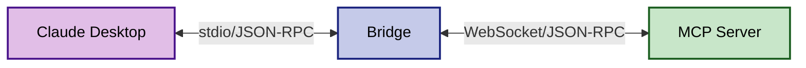
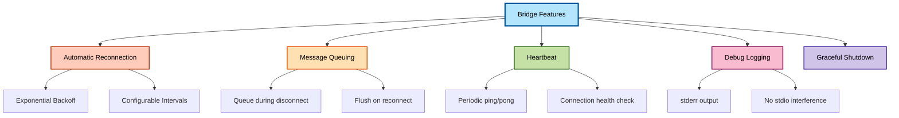
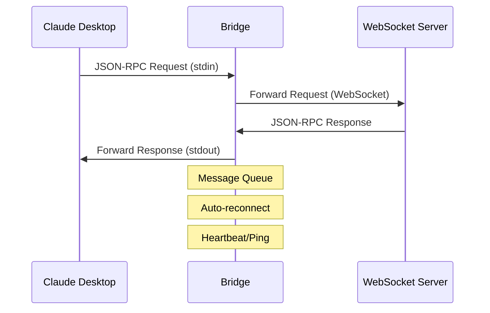
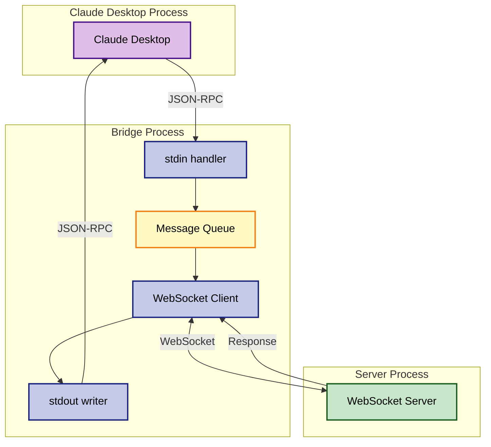

# MCP WebSocket Bridge

A bridge application that enables Claude Desktop to connect to WebSocket-based MCP servers by translating between stdio and WebSocket protocols.

## Overview

This bridge acts as a protocol translator:



- **Input**: Accepts MCP messages via stdio from Claude Desktop
- **Output**: Forwards messages over WebSocket to an MCP server

## Installation

```bash
cd bridge
npm install
```

## Usage

### Command Line

```bash
# Basic usage with default settings (connects to ws://localhost:61822/mcp)
node mcp-websocket-bridge.js

# Connect to a specific WebSocket server
node mcp-websocket-bridge.js --url ws://example.com:8080/mcp

# With authentication token
node mcp-websocket-bridge.js --url wss://secure.example.com/mcp --token your-auth-token

# Enable debug logging
node mcp-websocket-bridge.js --debug
```

### Claude Desktop Configuration

Add to your `claude_desktop_config.json`:

```json
{
  "mcpServers": {
    "kapture": {
      "command": "node",
      "args": [
        "/path/to/kapture/bridge/mcp-websocket-bridge.js",
        "--url", "ws://localhost:61822/mcp"
      ]
    }
  }
}
```

Or with environment variables:

```json
{
  "mcpServers": {
    "kapture": {
      "command": "node",
      "args": ["/path/to/kapture/bridge/mcp-websocket-bridge.js"],
      "env": {
        "AUTH_TOKEN": "optional-token",
        "DEBUG": "true"
      }
    }
  }
}
```

## Features



- **Automatic Reconnection**: Reconnects with exponential backoff when connection is lost
- **Message Queuing**: Queues messages during disconnection and sends when reconnected
- **Heartbeat**: Maintains connection with periodic ping/pong
- **Debug Logging**: Optional debug output to stderr (doesn't interfere with stdio protocol)
- **Graceful Shutdown**: Properly closes connections on exit

## Options

| Option | Short | Description | Default |
|--------|-------|-------------|---------|
| --url | -u | WebSocket server URL | ws://localhost:61822/mcp |
| --token | -t | Authentication token | none |
| --debug | -d | Enable debug logging | false |
| --help | -h | Show help message | - |

## Environment Variables

- `AUTH_TOKEN`: Authentication token for server
- `DEBUG`: Set to "true" to enable debug logging

## Architecture



The bridge is transparent and doesn't modify messages - it simply forwards them between the two protocols while handling connection management.

### Message Flow



## Troubleshooting

1. **Connection Issues**: Enable debug mode to see detailed connection logs
2. **Authentication Errors**: Verify your token is correct and the server accepts it
3. **Message Errors**: Check that both Claude Desktop and the WebSocket server use compatible MCP versions

## Development

To use in development mode with the Kapture server:

1. Start the Kapture server (default port 61822)
2. Configure Claude Desktop to use this bridge
3. The bridge will automatically connect and relay messages