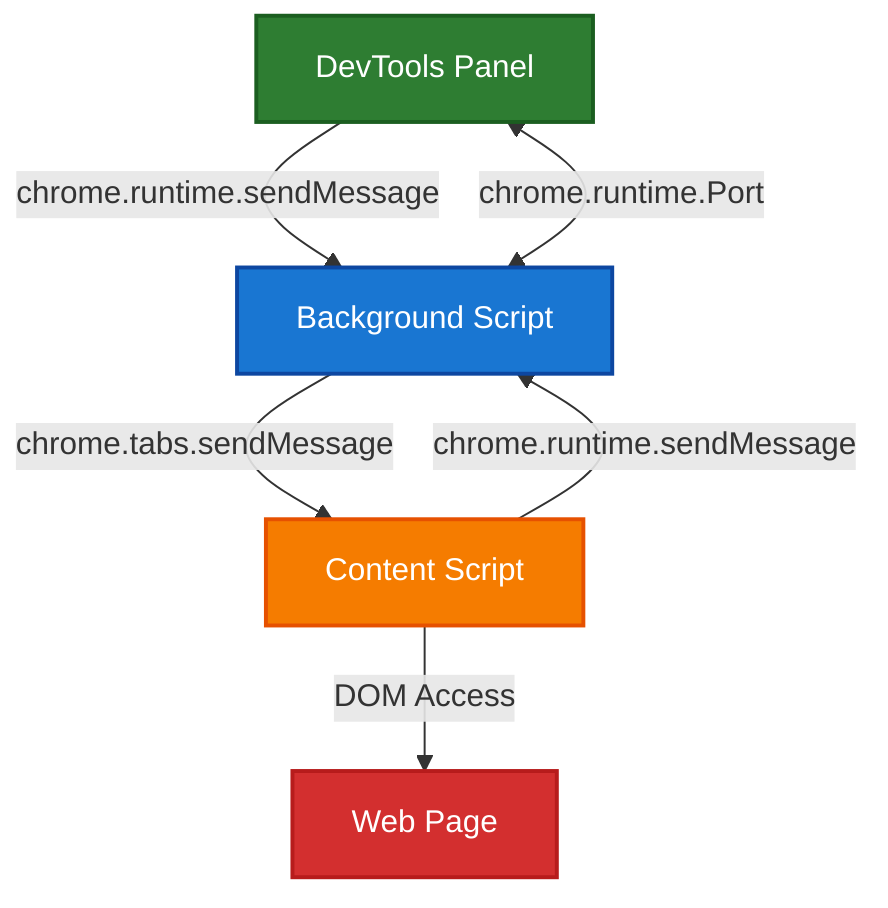
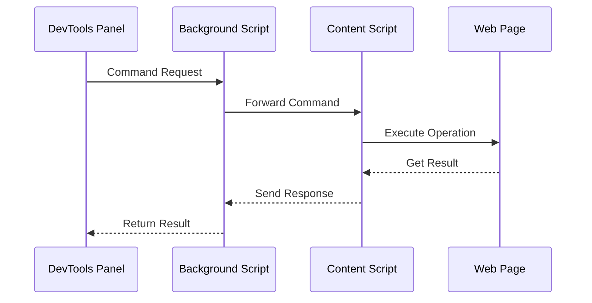
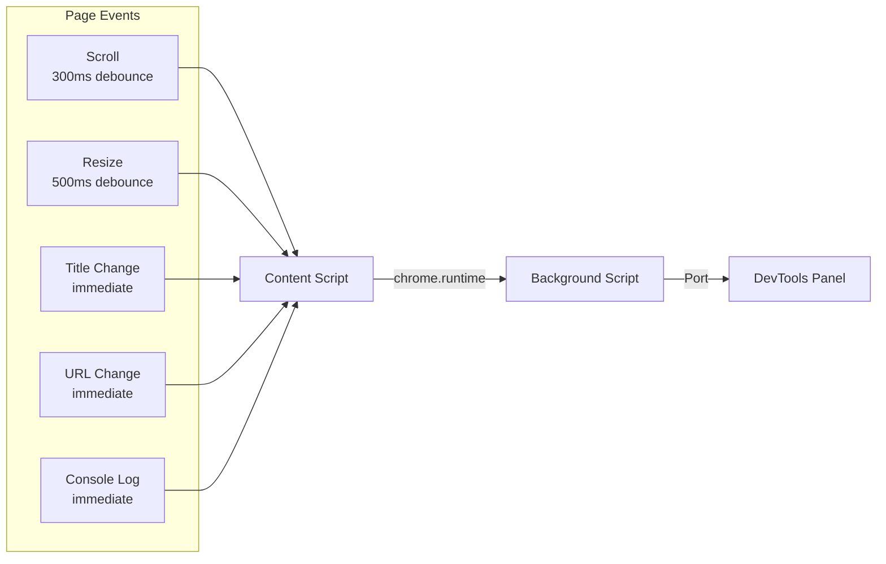

# Kapture Browser Automation Chrome Extension

This Chrome Extension enables browser automation through the Model Context Protocol (MCP), allowing AI assistants like Claude to interact with web pages.

## Installation

1. Open Chrome and navigate to `chrome://extensions/`
2. Enable "Developer mode" in the top right
3. Click "Load unpacked" and select this extension directory
4. The Kapture icon will appear in your Chrome toolbar

## Usage

1. Open Chrome DevTools (F12 or right-click → Inspect)
2. Navigate to the "Kapture" panel
3. Click "Connect" to establish connection with the MCP server
4. The extension will display a unique Tab ID for this browser tab
5. Use this Tab ID when executing MCP commands
6. You can even ask your AI assistant to list the connected tabs and their IDs for you

## Architecture

The extension uses a secure message passing architecture to execute commands on web pages:

### Message Flow

### Real-time Updates

The extension provides real-time updates for page changes:

## Features

- **Real-time Connection Status**: See when you're connected to the MCP server
- **Message Logging**: View all commands and responses in real-time
- **Screenshot Capture**: Supports WebP/JPEG formats with compression
- **Element Interaction**: Click, hover, fill forms, and more
- **Console Access**: Read browser console logs with real-time streaming
- **DOM Inspection**: Extract page structure and content
- **Tab Info Updates**: Real-time monitoring of page changes (URL, title, scroll position)
- **Secure Message Passing**: All operations use Chrome's extension APIs, no eval()

## Technical Details

### Components

- **content-script.js**: Injected into web pages to handle DOM operations
- **background.js**: Service worker that routes messages between components
- **panel/panel.js**: DevTools panel UI and WebSocket communication
- **panel/command-executor.js**: Executes browser automation commands
- **panel/message-passing.js**: Handles communication with content scripts

### Security

- All page operations use Chrome's message passing APIs
- No use of `eval()` for better security (except for the evaluate command)
- Content scripts have limited permissions
- Each tab is isolated with unique IDs

## Requirements

- Chrome browser version 88 or higher
- Kapture MCP server running on localhost:61822
- Chrome DevTools open for the extension panel to be accessible

## Privacy

- All communication happens locally between the extension and localhost
- No data is sent to external servers
- The extension only accesses web pages when you explicitly execute commands

## Troubleshooting

**Connection Issues:**
- Ensure the MCP server is running on port 61822
- Check that no firewall is blocking localhost connections
- Try disconnecting and reconnecting

**Tab Not Found Errors:**
- Refresh the tab list in your MCP client
- Ensure DevTools remains open
- Check that the correct Tab ID is being used

## Support

For issues and feature requests, visit: https://github.com/williamkapke/kapture
