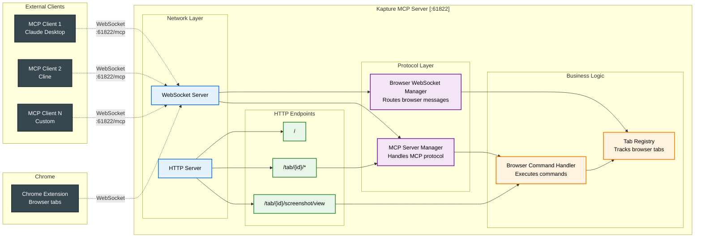
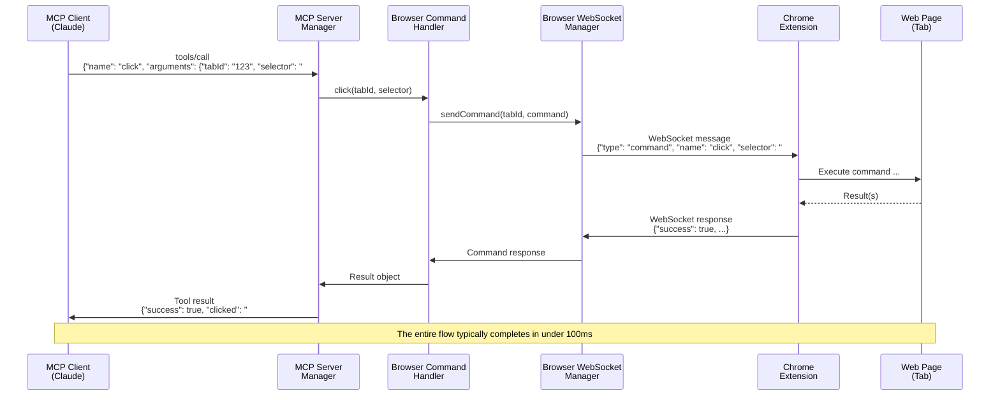
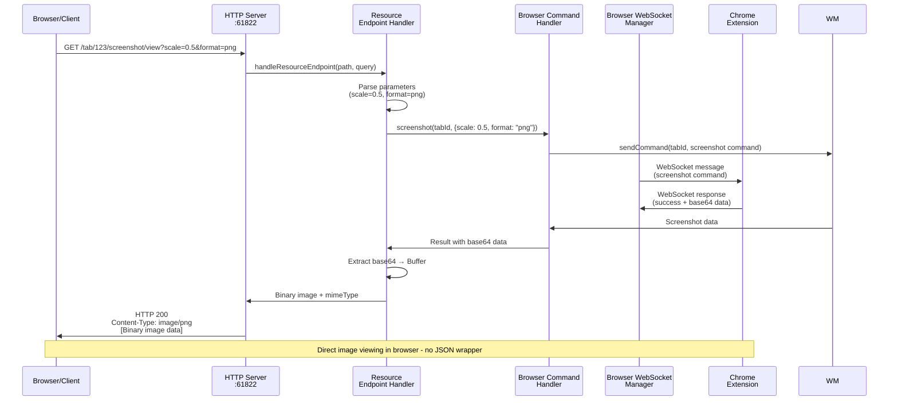

# Kapture MCP Server

MCP server for Kapture browser automation. This server enables AI assistants like Claude to control web browsers through the Kapture Chrome extension.

**✨ Key Feature**: Support for multiple AI assistants running simultaneously! All clients connect via WebSocket to the same server.

## Quick Start

### Run with npx (no installation required)

```bash
npx kapture-mcp-server
```

The server automatically runs on port 61822.

### Smart Server Detection

When running `npx kapture-mcp-server`, it automatically detects if a server is already running:
- **No existing server**: Starts a new server
- **Server already running**: Shows connection info and exits gracefully

This prevents port conflicts and provides helpful information about existing connections.

### Install globally

```bash
npm install -g kapture-mcp-server
kapture-server
```

### Install locally in a project

```bash
npm install kapture-mcp-server
```

## Usage with Claude Desktop

Add to your Claude Desktop configuration:

```json
{
  "mcpServers": {
    "kapture": {
      "command": "npx",
      "args": ["kapture-mcp-server"]
    }
  }
}
```

Or if you installed it globally:

```json
{
  "mcpServers": {
    "kapture": {
      "command": "kapture-server"
    }
  }
}
```

## Command Line Options

None - the server always runs on port 61822

## Running Multiple AI Assistants

Kapture supports multiple AI clients through a single server instance:

- **All clients**: Connect via WebSocket to `ws://localhost:61822/mcp`
- All clients share access to the same browser tabs

**Example: Claude Desktop + Cline**

Start the server manually:
```bash
npx kapture-mcp-server
```

Claude Desktop (claude_desktop_config.json):
```json
{
  "mcpServers": {
    "kapture": {
      "transport": "websocket",
      "url": "ws://localhost:61822/mcp"
    }
  }
}
```

Cline (VS Code settings.json) - WebSocket connection:
```json
{
  "cline.mcpServers": {
    "kapture": {
      "transport": "websocket",
      "url": "ws://localhost:61822/mcp"
    }
  }
}
```

All connected clients can control the same browser tabs simultaneously.

## Requirements

- Node.js 18 or higher
- Chrome browser with Kapture extension installed

## How it Works

1. The MCP server starts and listens on port 61822
2. The Kapture Chrome extension connects to the server via WebSocket
3. AI assistants can now control the browser through MCP tools

## Server Architecture



### Component Responsibilities

- **HTTP Server**: Main entry point, handles HTTP requests and WebSocket upgrades
- **WebSocket Server**: Manages all WebSocket connections (both MCP clients and browser extensions)
- **Tab Registry**: Maintains state of all connected browser tabs
- **MCP Handler**: Executes MCP commands and returns responses
- **Browser WebSocket Manager**: Routes messages between browser extensions and command handlers
- **MCP Server Manager**: Implements MCP protocol for each connected client

## Message Flow Example

Here's how a tool call flows through the system when an MCP client (like Claude) clicks a button on a webpage:



This sequence shows:
1. **MCP Protocol Layer**: Client sends JSON-RPC tool call
2. **Command Routing**: Server routes through appropriate handlers
3. **WebSocket Bridge**: Commands cross from MCP to browser extension
4. **DOM Interaction**: Extension executes in browser context
5. **Response Chain**: Results flow back through the same path

### HTTP Request Flow

Here's how an HTTP request works when viewing a screenshot image directly:



This shows the key difference from MCP tool calls:
1. **Direct HTTP Access**: Browser/client makes standard HTTP GET request
2. **Resource Routing**: Server identifies this as a special resource endpoint
3. **Image Conversion**: Base64 data is converted to binary for direct viewing
4. **Standard HTTP Response**: Returns actual image, not JSON

## Available MCP Tools

- `navigate` - Navigate to URL
- `back` - Browser back button
- `forward` - Browser forward button
- `click` - Click elements
- `hover` - Hover over elements
- `fill` - Fill input fields
- `select` - Select dropdown options
- `evaluate` - Execute JavaScript
- `elements` - Query all elements matching a CSS selector or XPath with optional visibility filtering

## MCP Resources

- `kapture://tabs` - List all connected browser tabs
- `kapture://tab/{tabId}` - Get detailed tab information
- `kapture://tab/{tabId}/console` - Get console logs
- `kapture://tab/{tabId}/screenshot` - Capture screenshots
- `kapture://tab/{tabId}/dom` - Get DOM HTML
- `kapture://tab/{tabId}/elementsFromPoint` - Get elements at coordinates
- `kapture://tab/{tabId}/elements?selector={selector}&visible={true|false|all}` - Query all elements matching a CSS selector or XPath with optional visibility filtering

## Documentation

For full documentation and Chrome extension installation, visit:
https://github.com/williamkapke/kapture

## License

MIT
