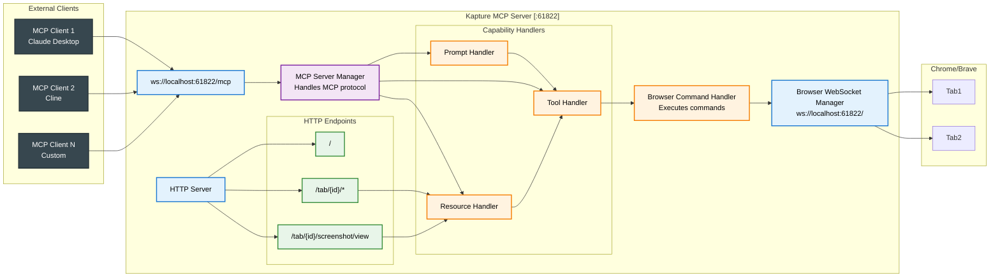

# Kapture MCP Server

MCP server for Kapture browser automation. This server enables AI assistants like Claude to control web browsers through the Kapture Chrome extension.

**✨ Key Feature**: Support for multiple AI assistants running simultaneously! All clients connect via WebSocket to the same server.

## Quick Start

### Run with npx (no installation required)

```bash
npx kapture-mcp-server
```

The server automatically runs on port 61822.

### Bridge mode (Alternative for stdio-based MCP clients)

```bash
npx kapture-mcp-server bridge
```

This starts the server and provides stdio-to-WebSocket translation using the built-in mcp2websocket bridge.

### Smart Server Detection

When running `npx kapture-mcp-server`, it automatically detects if a server is already running:
- **No existing server**: Starts a new server
- **Server already running**: Shows connection info and exits gracefully

This prevents port conflicts and provides helpful information about existing connections.

### Install globally

```bash
npm install -g kapture-mcp-server
kapture-mcp-server
```

### Install locally in a project

```bash
npm install kapture-mcp-server
```

## Usage with Claude Desktop

### Recommended: Using the bridge command
This single command starts the server and handles stdio communication:
```json
{
  "mcpServers": {
    "kapture": {
      "command": "npx",
      "args": ["kapture-mcp-server", "bridge"]
    }
  }
}
```

### Alternative: Direct WebSocket connection
First start the server:
```bash
npx kapture-mcp-server
```

Then configure Claude Desktop to use WebSocket transport:
```json
{
  "mcpServers": {
    "kapture": {
      "transport": "websocket",
      "url": "ws://localhost:61822/mcp"
    }
  }
}
```

## Command Line Options

- **No arguments**: Starts the server on port 61822
- `bridge`: Starts the server and provides stdio-to-WebSocket bridge for MCP clients

The server always runs on port 61822

## Running Multiple AI Assistants

Kapture supports multiple AI clients through a single server instance:

- **All clients**: Connect via WebSocket to `ws://localhost:61822/mcp`
- All clients share access to the same browser tabs

**Example: Claude Desktop + Cline**

Start the server manually:
```bash
npx kapture-mcp-server
```

Claude Desktop (claude_desktop_config.json):
```json
{
  "mcpServers": {
    "kapture": {
      "command": "npx",
      "args": ["kapture-mcp-server", "bridge"]
    }
  }
}
```

Cline (VS Code settings.json) - WebSocket connection:
```json
{
  "cline.mcpServers": {
    "kapture": {
      "transport": "websocket",
      "url": "ws://localhost:61822/mcp"
    }
  }
}
```

All connected clients can control the same browser tabs simultaneously.

## Requirements

- Node.js 18 or higher
- Chrome browser with Kapture extension installed

## How it Works

1. The MCP server starts and listens on port 61822
2. The Kapture Chrome extension connects to the server via WebSocket
3. AI assistants can now control the browser through MCP tools

## Server Architecture



### Component Responsibilities

- **HTTP Server**: Main entry point, handles HTTP requests and WebSocket upgrades
- **WebSocket Server**: Manages all WebSocket connections (both MCP clients and browser extensions)
- **Tab Registry**: Maintains state of all connected browser tabs
- **Browser Command Handler**: Executes browser commands with timeout handling
- **Browser WebSocket Manager**: Routes messages between browser extensions and command handlers
- **MCP Server Manager**: Implements MCP protocol for each connected client
- **Tool Handler**: Processes MCP tool calls and validates inputs
- **Resource Handler**: Handles MCP resource requests (tabs, console logs, screenshots, DOM)
- **Prompt Handler**: Manages MCP prompt operations


## Available MCP Tools

- `navigate` - Navigate to URL
- `back` - Browser back button
- `forward` - Browser forward button
- `click` - Click elements
- `hover` - Hover over elements
- `fill` - Fill input fields
- `select` - Select dropdown options
- `evaluate` - Execute JavaScript
- `elements` - Query all elements matching a CSS selector or XPath with optional visibility filtering

## MCP Resources

- `kapture://tabs` - List all connected browser tabs
- `kapture://tab/{tabId}` - Get detailed tab information
- `kapture://tab/{tabId}/console` - Get console logs
- `kapture://tab/{tabId}/screenshot` - Capture screenshots
- `kapture://tab/{tabId}/dom` - Get DOM HTML
- `kapture://tab/{tabId}/elementsFromPoint` - Get elements at coordinates
- `kapture://tab/{tabId}/elements?selector={selector}&visible={true|false|all}` - Query all elements matching a CSS selector or XPath with optional visibility filtering

## Documentation

For full documentation and Chrome extension installation, visit:
https://github.com/williamkapke/kapture

## License

MIT
