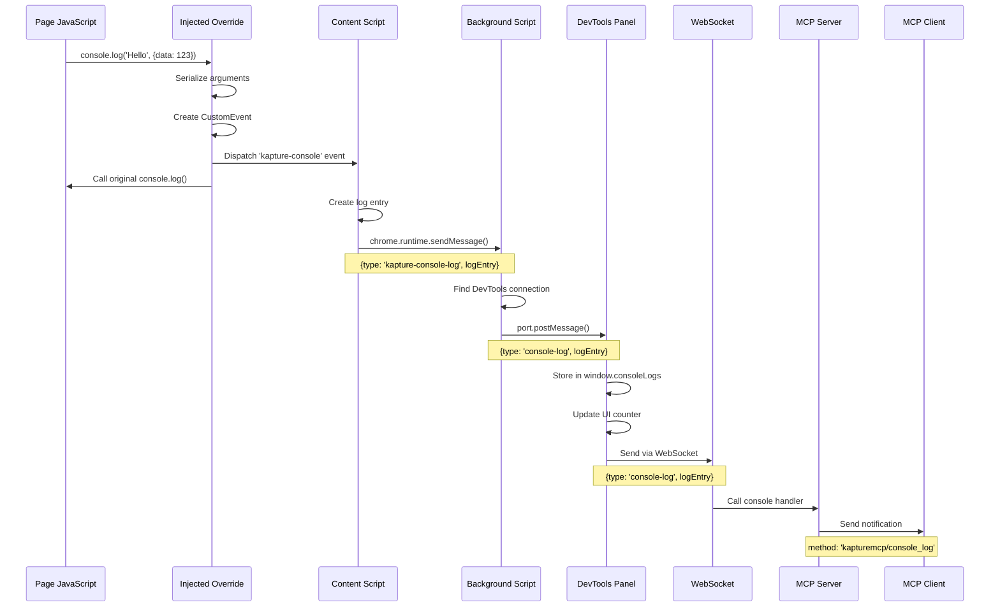
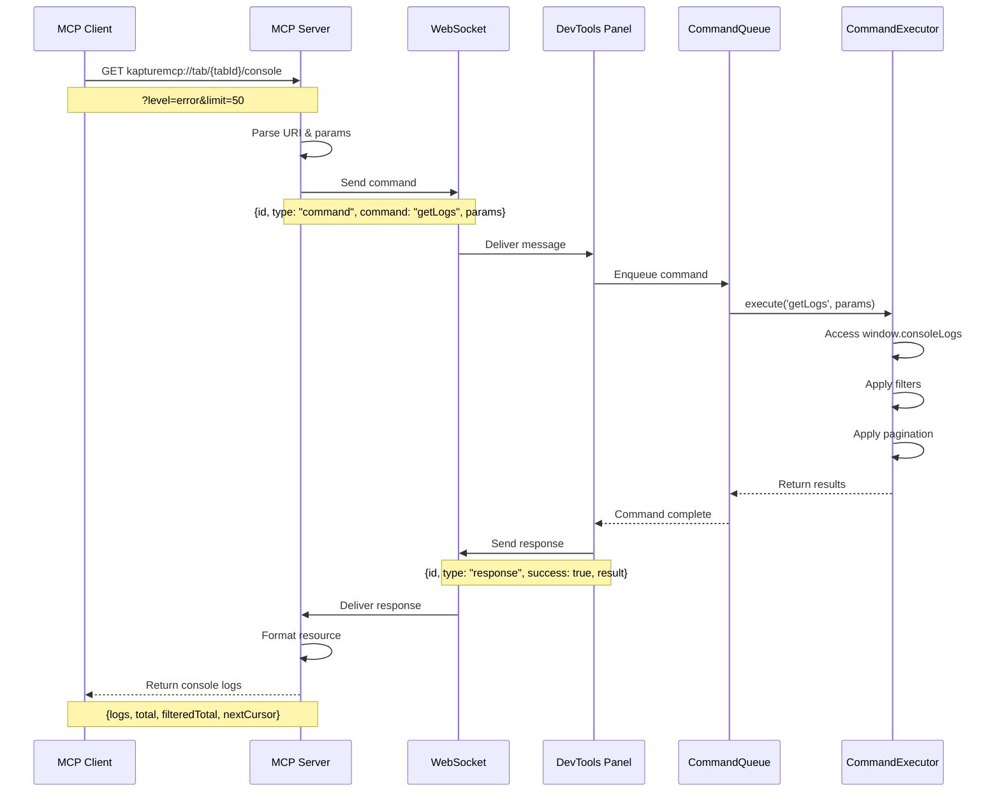

# Console Logs Message Flow

This document describes the message flow for console log capture in Kapture, covering both real-time event streaming and historical log retrieval.

## Overview

Kapture captures console logs from web pages using Chrome DevTools APIs and stores them in the DevTools panel for efficient retrieval. The system bypasses Content Security Policy (CSP) restrictions by injecting console overrides directly into the page context via `chrome.devtools.inspectedWindow.eval()`.

## Architecture Components

### Component Diagram

```mermaid
graph TB
    subgraph "Browser Tab"
        Page[Page Context]
        Override[Injected Console Override]
        CS[Content Script]
    end
    
    subgraph "Chrome Extension"
        BG[Background Script]
        subgraph "DevTools"
            Panel[DevTools Panel]
            Storage[(window.consoleLogs)]
        end
    end
    
    subgraph "External"
        WS[WebSocket Manager]
        MCP[MCP Server]
        Client[MCP Client]
    end
    
    Page -.->|console.log()| Override
    Override -->|CustomEvent| CS
    CS -->|chrome.runtime| BG
    BG -->|port.postMessage| Panel
    Panel -->|stores| Storage
    Panel <-->|WebSocket| WS
    WS <--> MCP
    MCP <--> Client
    
    style Page fill:#f9f,stroke:#333,stroke-width:2px
    style Storage fill:#bbf,stroke:#333,stroke-width:2px
    style Client fill:#bfb,stroke:#333,stroke-width:2px
```

### Component Descriptions

1. **Page Context** - The inspected web page where console methods are called
2. **Injected Console Override** - JavaScript code injected into the page that intercepts console calls
3. **Content Script** - Listens for console events and forwards them to the background
4. **Background Script** - Routes messages between content scripts and DevTools panel
5. **DevTools Panel** - Stores logs and handles MCP commands
6. **WebSocket Connection** - Links the panel to the MCP server
7. **MCP Server** - Handles MCP protocol and sends notifications

## Real-Time Console Events Flow

When JavaScript in the inspected page calls a console method (log, info, warn, error):

### Mermaid Sequence Diagram



### Text Flow

```
1. Page JavaScript
   └─> console.log('Hello', {data: 123})

2. Injected Console Override (via chrome.devtools.inspectedWindow.eval)
   ├─> Serializes arguments: ['Hello', '{"data":123}']
   ├─> Creates CustomEvent('kapture-console', {detail: {level, args, timestamp}})
   ├─> Dispatches event on window
   └─> Calls original console.log()

3. Content Script (isolated world)
   ├─> Listens for 'kapture-console' events
   ├─> Creates log entry: {timestamp, level, message}
   └─> chrome.runtime.sendMessage({type: 'kapture-console-log', logEntry})

4. Background Script
   ├─> Receives message from content script
   ├─> Looks up DevTools connection for sender.tab.id
   └─> port.postMessage({type: 'console-log', logEntry})

5. DevTools Panel
   ├─> Receives message via background port
   ├─> Stores in window.consoleLogs array (max 1000 entries)
   ├─> Updates UI log counter
   └─> Forwards to server via WebSocket

6. WebSocket Manager
   ├─> Receives console-log message
   └─> Calls registered console log handler

7. MCP Server
   └─> Sends MCP notification: {
         method: 'kapturemcp/console_log',
         params: {tabId, logEntry, timestamp}
       }

8. MCP Client
   └─> Receives real-time console log notification
```

## Console History Retrieval Flow

When an MCP client requests console logs via the resource endpoint:

### Mermaid Sequence Diagram



### Text Flow

```
1. MCP Client
   └─> GET kapturemcp://tab/{tabId}/console?level=error&limit=50

2. MCP Server
   ├─> Parses resource URI and query parameters
   └─> Sends WebSocket command: {
         id: "unique-id",
         type: "command", 
         command: "getLogs",
         params: {tabId, level, limit, before}
       }

3. DevTools Panel (via WebSocket)
   ├─> Receives command message
   └─> Enqueues command in CommandQueue

4. CommandQueue
   └─> Calls CommandExecutor.execute('getLogs', params)

5. CommandExecutor
   ├─> Directly accesses window.consoleLogs array
   ├─> Applies filters (level, before timestamp)
   ├─> Applies limit and pagination
   └─> Returns: {logs: [...], total: 1000, filteredTotal: 45}

6. DevTools Panel
   └─> Sends response via WebSocket: {
         id: "unique-id",
         type: "response",
         success: true,
         result: {logs, total, filteredTotal}
       }

7. MCP Server
   ├─> Receives WebSocket response
   └─> Returns resource: {
         logs: [...],
         total: 1000,
         filteredTotal: 45,
         limit: 50,
         level: "error",
         nextCursor: "2024-01-01T12:00:00.000Z"
       }

8. MCP Client
   └─> Receives console log history
```

## Key Design Decisions

### 1. DevTools Injection for CSP Bypass
- Uses `chrome.devtools.inspectedWindow.eval()` to inject console overrides
- Works on all websites regardless of Content Security Policy
- Runs in the page's JavaScript context, not the content script's isolated world

### 2. Panel-Based Storage
- Logs stored in DevTools panel (`window.consoleLogs`) instead of content script
- Eliminates need for message passing during retrieval
- Direct synchronous access for `getLogs` command
- Automatic cleanup on navigation (panel clears the array)

### 3. Single Event Type
- Uses one `kapture-console` event for all log levels
- Level included in event detail rather than event name
- Simplifies both injection and listener code

### 4. Real-Time Streaming
- Every console call immediately flows through the entire chain
- No batching or buffering (except the 1000-entry limit)
- MCP clients receive notifications as logs happen

## Limitations

1. **Storage Limit**: Maximum 1000 logs kept in memory (FIFO)
2. **Content Script Required**: Page must have content script injected for forwarding
3. **DevTools Must Be Open**: Console capture only works while DevTools panel is active
4. **Navigation Clears Logs**: Logs are cleared when navigating to a new page

## Error Handling

- **Extension Context Invalidated**: Wrapped in try-catch blocks, silently ignored
- **Missing Content Script**: Background script attempts automatic injection
- **WebSocket Disconnection**: Logs continue to be stored locally, forwarding resumes on reconnect
- **Serialization Errors**: Caught and converted to string representation