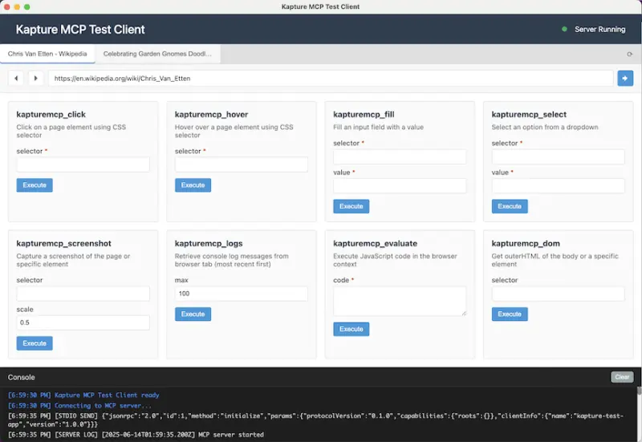
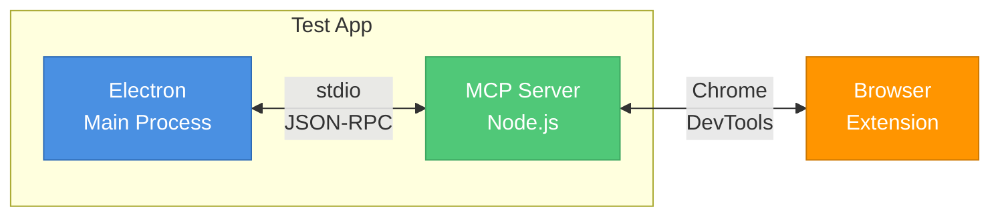

# Kapture MCP Test Client

A robust Electron-based test application for the Kapture MCP server that implements the full MCP protocol via stdio communication, exactly matching Claude Desktop's implementation.

## Overview

This test client provides a comprehensive development and testing environment for the Kapture MCP server, featuring a modern browser-style interface with real-time tab management, tool discovery, and execution capabilities.



## Key Features

### 🔌 MCP Protocol Implementation
- **Native stdio communication** - Exact same protocol as Claude Desktop
- **JSON-RPC message handling** - Full bidirectional communication
- **Automatic server lifecycle management** - Server starts/stops with the app
- **Real-time connection status** - Visual indicators for server and tab states

### 📑 Tab Management
- **Browser-style tab interface** - Familiar tab bar with active/inactive states
- **Live tab synchronization** - Automatically updates when tabs connect/disconnect
- **Tab information display** - Shows tab ID, title, and URL
- **Quick tab switching** - Click to select and view available tools

### 🛠️ Tool Discovery & Execution
- **Dynamic tool listing** - Discovers all available MCP tools automatically
- **Parameter visualization** - Shows required and optional parameters with types
- **Smart parameter forms** - Type-specific input fields (text, number, boolean)
- **Batch operations** - Execute multiple tools in sequence

### 💻 Developer Experience
- **Formatted JSON responses** - Syntax-highlighted, collapsible JSON output
- **Console logging** - Real-time operation logs and error messages
- **Copy functionality** - One-click copy for tool responses
- **Error handling** - Clear error messages with stack traces

### 🎨 UI/UX Enhancements
- **Responsive design** - Adapts to window resizing
- **Loading states** - Visual feedback during operations
- **Keyboard shortcuts** - Cmd+R to refresh, standard Electron shortcuts
- **Dark theme support** - Matches system preferences

## Installation & Setup

1. **Install dependencies:**
```bash
cd test-app
npm install
```

2. **Build the server (if not already built):**
```bash
cd ../server
npm run build
```

3. **Start the test client:**
```bash
cd ../test-app
npm start
```

## Usage Guide

### Basic Workflow
1. Launch the app - MCP server starts automatically
2. Open Chrome with the Kapture extension installed
3. Navigate to any webpage and open DevTools
4. Go to the Kapture panel and select the server to connect
5. The connection to the tab appears instantly in test-app's

### Tool Execution
1. Select a tab from the tab bar (if multiple tabs are connected)
2. Browse available tools in the main panel
3. Fill in required parameters (marked with *)
4. Click "Execute" to run the tool
5. View the response below the tool

### Advanced Features
- **Multiple tabs**: Connect multiple Chrome tabs simultaneously
- **Response inspection**: Click on JSON responses to expand/collapse
- **Error recovery**: Server automatically restarts on crashes

## Architecture

### Process Communication


### Key Components
- **main.js**: Electron main process, spawns MCP server, handles stdio
- **preload.js**: Secure bridge between main and renderer processes
- **renderer.js**: UI logic, user interactions, display formatting
- **styles.css**: Modern, responsive styling with animations

## Development

### Development Mode
```bash
npm run dev  # Opens with DevTools enabled
```

### Debugging Tips
- Check the console for detailed logs
- Use Chrome DevTools in the test client (Cmd+Option+I)
- Monitor server logs in the console output (debug logging is enabled by default)
- All stdio messages and server stderr output are displayed with prefixes like [STDIO], [SERVER LOG]

### Common Issues
- **Tabs not appearing**: Ensure Chrome extension is connected
- **Tools not loading**: Verify server build is up to date

## Testing Scenarios

### Basic Testing
1. Tool parameter validation
2. Response formatting
3. Error handling
4. Tab connection/disconnection

### Advanced Testing
1. Concurrent tool execution
2. Large response handling
3. Network interruption recovery
4. Memory usage monitoring

## Contributing

When testing new MCP tools:
1. Add the tool to the server
2. Rebuild the server (`npm run build`)
3. Restart the test client
4. Verify tool appears and executes correctly

## Requirements

- Node.js 16+
- Chrome browser with Kapture extension
- macOS, Windows, or Linux

## License

Part of the Kapture project - see main repository for license details.
